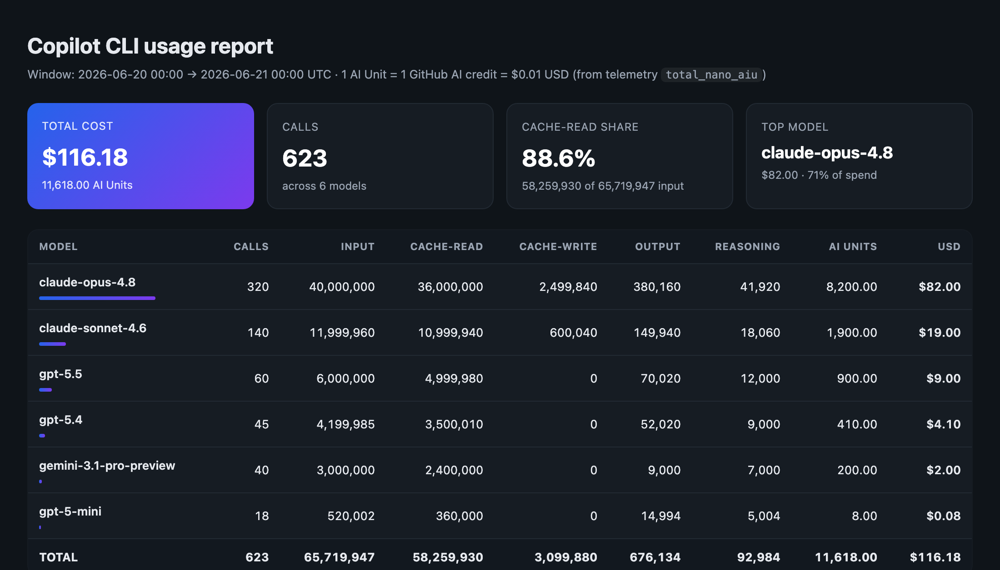

# copilot-usage-report

[](https://github.com/trsdn/copilot-usage-report/actions/workflows/ci.yml)
[](LICENSE)
[](https://www.python.org/)


[](https://docs.github.com/copilot/concepts/agents/about-copilot-cli)


A [GitHub Copilot CLI](https://docs.github.com/copilot/concepts/agents/about-copilot-cli)
**skill** that generates a token-and-cost usage report from your local Copilot CLI
telemetry, broken down per model and converted to **GitHub AI Units / AI Credits / USD**.

Ask the agent something like *"how many tokens / AI credits did I use in the last 48h?"*
and it runs the bundled parser and presents a markdown table. The script also works as a
plain standalone CLI and can emit **JSON** or a **self-contained HTML report** (`--html`).

> **Privacy:** everything runs locally against `~/.copilot/logs/`. No data leaves your
> machine, nothing is uploaded.

## HTML report (`--html`)

A self-contained, offline report — summary cards plus a per-model table with spend bars
(dark-mode aware, inline CSS, no external assets):



> Sample shown with synthetic data. Generate your own with
> `… --html --out usage.html` (see [Standalone CLI usage](#standalone-cli-usage)).

## Example (markdown, default)

```bash
python3 copilot-usage-report/scripts/usage_report.py 24h
```

```
# Copilot CLI usage report

**Window (UTC):** 2026-06-22 06:30 → 2026-06-23 06:30
**Basis:** 1 AI Unit = 1 GitHub AI credit = $0.01 USD (from telemetry `total_nano_aiu`).

| Model | Calls | Input | Cache-read | Cache-write | Output | Reasoning | AI Units | USD |
|---|--:|--:|--:|--:|--:|--:|--:|--:|
| claude-opus-4.8 | 1490 | 156,914,754 | 146,333,432 | 10,510,108 | 1,362,434 | 123,729 | 17,327.18 | $173.27 |
| ... | | | | | | | | |
| **TOTAL** | **2597** | **242,246,546** | ... | | | | **22,609.50** | **$226.09** |

- **Total cost: 22,609.50 AI Units = $226.09**
- Cache-read share of input: **93.5%**
- Top model: **claude-opus-4.8** at $173.27 (77% of spend)
```

## Install as a Copilot CLI skill

Copilot CLI discovers skills under `.copilot/skills/` (per-project) or
`~/.copilot/skills/` (global). Drop the `copilot-usage-report/` folder into either:

```bash
# global, available in every session
git clone https://github.com/trsdn/copilot-usage-report.git
mkdir -p ~/.copilot/skills
cp -r copilot-usage-report/copilot-usage-report ~/.copilot/skills/

# …or per-project
cp -r copilot-usage-report/copilot-usage-report <your-repo>/.copilot/skills/
```

The skill is then auto-loaded; just ask the agent for a usage report.

## Standalone CLI usage

Requires **Python 3** (standard library only — no dependencies).

```bash
python3 copilot-usage-report/scripts/usage_report.py <TIMEFRAME>
```

`<TIMEFRAME>` accepts:

| Form | Meaning |
|---|---|
| `30m`, `12h`, `48h`, `7d`, `2w` | relative window ending now (UTC); default `24h` |
| `today`, `yesterday` | calendar day (UTC) |
| `--from ISO --to ISO` | explicit window, e.g. `--from 2026-06-01T00:00:00 --to 2026-06-08T00:00:00` |

Other flags:

- `--json` — machine-readable output instead of the markdown table.
- `--html` — a **self-contained, offline** HTML report (summary cards + per-model
  table with spend bars; inline CSS, no external assets).
- `--out FILE` — write the report to a file instead of stdout (works with any format).
- `--logs DIR` — point at a different log directory (default `~/.copilot/logs`).

```bash
python3 copilot-usage-report/scripts/usage_report.py 7d
python3 copilot-usage-report/scripts/usage_report.py today
python3 copilot-usage-report/scripts/usage_report.py 7d --html --out usage.html
python3 copilot-usage-report/scripts/usage_report.py --from 2026-06-01T00:00:00 --to 2026-06-08T00:00:00 --json
```

> Log files can total **>1 GB**; the parser streams them, so a run takes ~10–30 s.

## How it works

Copilot CLI writes `assistant_usage` telemetry events to `~/.copilot/logs/*.log`. Each
event carries `properties.model` and a `metrics` block. The report aggregates per model:

- `input_tokens = input_tokens_uncached + cache_read_tokens + cache_write_tokens`
- **AI Units (AIU)** `= total_nano_aiu / 1e9` — GitHub's own billed amount.
- Billing basis (GitHub official): **1 AI Unit = 1 GitHub AI credit = $0.01 USD**, so
  `USD = AIU / 100`. AIU is authoritative and stays correct even for models not in the
  local rate card.
- `cache_write` is a real, separately-billed operation for Anthropic models only; OpenAI
  / Google rate cards have no cache-write charge.

The optional per-1M-token `RATES` table in the script is a **cross-check only** — AIU
from telemetry is the source of truth. Update rates from the official page:
<https://docs.github.com/en/copilot/reference/copilot-billing/models-and-pricing>

## Repo layout

```
copilot-usage-report/
├── README.md
├── LICENSE
├── .github/workflows/ci.yml    # smoke test on Python 3.8 / 3.10 / 3.12
├── tests/
│   └── smoke.py                # dependency-free markdown/JSON/HTML smoke test
├── docs/
│   ├── sample-report.html      # example HTML report (synthetic data)
│   └── sample-report.png       # screenshot used in this README
└── copilot-usage-report/       # the drop-in skill (copy into .copilot/skills/)
    ├── SKILL.md                # skill manifest + agent instructions
    └── scripts/
        └── usage_report.py     # the parser / standalone CLI
```

## Contributing

Issues and PRs welcome. The script is plain Python 3 standard library — no build, no
dependencies. Run the smoke test before sending a PR:

```bash
python3 tests/smoke.py
```

When a new model appears, add its per-1M-token rates to `RATES` in
`usage_report.py` from the
[official pricing page](https://docs.github.com/en/copilot/reference/copilot-billing/models-and-pricing)
(AIU from telemetry remains authoritative; the rate card is only a cross-check).

## License

[MIT](LICENSE)
